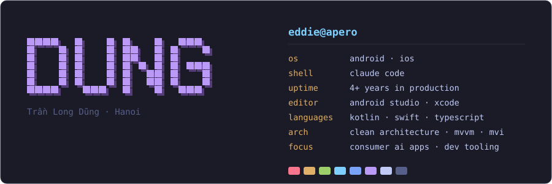

<picture>
  <source media="(prefers-color-scheme: dark)" srcset="neofetch-dark.svg" />
  <source media="(prefers-color-scheme: light)" srcset="neofetch-light.svg" />
  
</picture>

---


```bash
$ whoami
Eddie Tran — Trần Long Dũng
Mobile developer, 4 years. Consumer AI apps
on Android and iOS. I care what the codebase
looks like in month eighteen, not launch day.

$ cd ~/now && ls -1
consumer AI apps — at work
personal AI tooling — agents, memory, gates
```

<!-- add project here -->
<!-- - [Project name](https://link) — one line on what it does -->

<br clear="right" />

---

### Stack

<div align="center">

[](https://skillicons.dev)

</div>

---

### Contribution snake

<div align="center">

<picture>
  <source media="(prefers-color-scheme: dark)" srcset="https://raw.githubusercontent.com/dungtran-apero/dungtran-apero/output/snake-dark.svg" />
  <source media="(prefers-color-scheme: light)" srcset="https://raw.githubusercontent.com/dungtran-apero/dungtran-apero/output/snake.svg" />
  
</picture>

</div>

---

<div align="center">

[](https://www.linkedin.com/in/dunglongtran/)
[](mailto:longdugg.trn@gmail.com)

</div>

```bash
$ exit
ships > talks
```

<div align="center">

</div>
