<div align="center">


<a href="https://github.com/dungtran-apero">
  
</a>

</div>

---



```bash
$ whoami
Dũng — mobile developer. Four years shipping consumer AI apps
to real users on Android and iOS. I care what the codebase
looks like in month eighteen, not launch day.

$ cat stack.yml
mobile:
  - kotlin, jetpack compose, kotlin multiplatform
  - swift, swiftui
architecture:
  - clean architecture, mvvm (ios), mvi (android)
  - multi-module gradle · swift package manager
backend_when_needed:
  - node.js, next.js, typescript
ai_workflow:
  - claude code, custom agents, memory systems, ci gates

$ uptime
4+ years in production
```

```bash
$ cd ~/now && ls -1
consumer AI apps — mobile, at work. Android multi-module and
  modular SwiftUI, the kind with a paywall and real users.
personal AI engineering tooling — agent orchestration, a layered
  memory system, and quality gates that fail by exit code
  instead of by opinion.
```

<!-- add project here -->
<!-- - [Project name](https://link) — one line on what it does -->
<!-- - [App on the App Store](https://link) — one line -->

---

### Stack

<div align="center">

[](https://skillicons.dev)

</div>

---

### Contribution snake

<div align="center">

<picture>
  <source media="(prefers-color-scheme: dark)" srcset="https://raw.githubusercontent.com/dungtran-apero/dungtran-apero/output/snake-dark.svg" />
  <source media="(prefers-color-scheme: light)" srcset="https://raw.githubusercontent.com/dungtran-apero/dungtran-apero/output/snake.svg" />
  
</picture>

</div>

---

<div align="center">

[](https://www.linkedin.com/in/dunglongtran/)
[](mailto:longdugg.trn@gmail.com)

</div>

```bash
$ exit
ships > talks
```

<div align="center">

</div>
